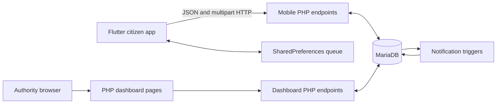

<div align="center">
  

# PatchUp

**A citizen pothole-reporting mobile app and authority management dashboard for Sri Lanka**


[Overview](#overview) | [Features](#implemented-features) | [Architecture](#architecture-and-flow) | [Technology](#technology-stack) | [Setup](#local-setup)

</div>

---

## Overview

PatchUp is an academic road-maintenance prototype with a Flutter app for citizens and a server-rendered PHP dashboard for road authorities. Citizens submit and review geotagged potholes, validate nearby reports, receive in-app notifications, and chat with administrators about reports they own; authorities monitor the dataset, update status, review users and validations, and respond through the dashboard. Both interfaces use procedural PHP endpoints backed by one MariaDB database. The repository targets local XAMPP development, stores configuration in source, uses HTTP for mobile traffic, and includes development data; it is not production-ready without the work listed below.

## Implemented features

### Citizen app

- Registration and sign-in with hashed citizen passwords; the signed-in email and selected language persist in `SharedPreferences`.
- Profile editing, password changes, logout, terms, project information, and account-specific report views.
- Reports with a required camera/gallery image, high-accuracy GPS coordinates, reverse-geocoded province, description, and `Small`, `Moderate`, or `Critical` severity.
- Failed or offline submissions queued locally and retried when Wi-Fi or mobile connectivity is detected.
- Server-side duplicate detection within 12 metres: an owner's duplicate is rejected, while another citizen's submission adds one unique validation.
- Latest, community, personal, and personally validated report feeds with status, severity, province, and date-range filters.
- Severity-weighted heatmaps for all, personal, and validated reports.
- Database-backed notifications for validations, status changes, and chat messages, with individual and bulk read actions.
- Report-owner chat with 30-message pagination, three-second polling, edits, and soft deletion.
- English, Sinhala, and Tamil UI resources with matching key sets.

### Authority dashboard

- Session-protected login/logout and responsive navigation.
- Totals, current-month activity, status/severity charts, leading reporters, recent reports, and province statistics.
- Report filters, a Leaflet heatmap, validation counts, ranked pending validated reports, map links, and status updates between `Reported`, `In Progress`, and `Resolved`.
- Per-report chat with five-second polling and message-count badges.
- Paginated customer and administrator directories; customer report history includes filters, validation counts, and a heatmap.
- Administrator creation, editing, and deletion.

## Architecture and flow



The PHP scripts in `patchup_app/lib/api/` are server code even though they live under the Flutter project. Apache serves them; Flutter does not compile them into the app. Dashboard pages call the separate endpoints in `patchup_website/api/`.

### Report lifecycle

1. The app requests location permission, obtains GPS coordinates, and maps the returned Sri Lankan district/administrative area to a province.
2. The citizen supplies an image, description, and severity.
3. The app uploads multipart form data or stores the payload and image path locally for a later retry.
4. `pothole_report.php` uses a Haversine calculation to find the nearest unresolved report within 12 metres.
5. The server creates a report, rejects the owner's duplicate, or records a unique validation by another citizen.
6. An administrator reviews the report, changes its status, and can chat with its owner. MariaDB triggers create the corresponding in-app notifications.

### Data model

| Table                | Purpose                                                                        |
| -------------------- | ------------------------------------------------------------------------------ |
| `user`               | Citizen accounts and shadow user rows created for dashboard chat               |
| `admin`              | Dashboard accounts                                                             |
| `potholereport`      | Owner, location, image, severity, description, status, province, and timestamp |
| `pothole_validation` | Unique `(ReportID, UserID)` confirmations                                      |
| `chat_messages`      | Per-report messages, edit/delete state, and administrator flag                 |
| `notification`       | Read state, message text, report reference, and JSON event metadata            |

`Xampp Database.sql` defines all six tables, indexes, foreign keys, three notification triggers, and development seed rows. It is a snapshot rather than a migration history.

PatchUp contains no machine-learning, LLM, or recommendation component. Duplicate handling is deterministic geospatial logic, heatmap intensity is a fixed severity weight (`Critical` 1.0, `Moderate` 0.7, `Small` 0.4), and report ordering/filtering is implemented with SQL and client-side rules.

## Technology stack

| Area        | Implementation                                                                                                      |
| ----------- | ------------------------------------------------------------------------------------------------------------------- |
| Mobile      | Flutter, Dart, Material widgets, Provider, `http`, and `shared_preferences`                                         |
| Device/maps | Geolocator, geocoding, image picker, connectivity monitoring, UUIDs, `flutter_map`, and CARTO tiles                 |
| Server      | PHP with MySQLi, PHP sessions, JSON responses, and multipart uploads                                                |
| Database    | MariaDB/MySQL-compatible SQL with triggers, foreign keys, and indexes                                               |
| Dashboard   | Server-rendered PHP, JavaScript, CSS, Tailwind CDN, Chart.js, Leaflet/Leaflet.heat, Feather Icons, and Font Awesome |

The lockfile requires Dart `>=3.7.2 <4.0.0` and Flutter `>=3.27.0`. The database export records PHP 8.2.12 and MariaDB 10.4.32.

## Repository layout

```text
.
├── patchup_app/
│   ├── assets/language/          English, Sinhala, and Tamil strings
│   ├── lib/api/                  Citizen-facing PHP endpoints
│   ├── lib/chat/                 Flutter chat model, service, and UI
│   ├── lib/pages/                Authentication, reporting, maps, and account UI
│   ├── lib/main.dart             Flutter entry point and session-aware startup
│   ├── uploads/                  Development images and upload destination
│   └── test/widget_test.dart     Generated, currently stale widget test
├── patchup_website/
│   ├── api/                      Dashboard queries and mutations
│   ├── database/                 Dashboard database connection
│   ├── css/ and javascript/      Dashboard styling and shared behavior
│   └── *.php                     Login, overview, reports, customers, and admins
├── Xampp Database.sql            Schema, triggers, indexes, and seed data
└── README.md
```

## Local setup

### Prerequisites

- Flutter compatible with the lockfile requirements above.
- XAMPP or equivalent Apache + PHP 8.2/MySQLi + MariaDB environment.
- An Android device/emulator and internet access for packages, map tiles, and dashboard CDN assets; physical devices must share a LAN with Apache.

### 1. Serve the PHP projects

The source URLs expect both folders directly below the Apache document root:

```text
C:\xampp\htdocs\
├── patchup_app\
└── patchup_website\
```

Copy the folders there or configure equivalent Apache aliases. Give Apache write access to `patchup_app/uploads/` for report images.

### 2. Create the database

Start Apache and MariaDB, create a database named `patchup`, then import the SQL snapshot with phpMyAdmin or PowerShell:

```powershell
& 'C:\xampp\mysql\bin\mysql.exe' -u root -e "CREATE DATABASE IF NOT EXISTS patchup CHARACTER SET utf8mb4 COLLATE utf8mb4_general_ci"
Get-Content -Raw '.\Xampp Database.sql' | & 'C:\xampp\mysql\bin\mysql.exe' -u root patchup
```

Add `-p` when the local database user requires a password.

### 3. Configure database access

No `.env` support is implemented. Set local-only connection values without committing real credentials in:

- `patchup_app/lib/database/db_connection.php`
- `patchup_website/database/db_connection.php`
- `patchup_website/api/chat_messages.php` (currently has its own direct MySQLi connection)

The connection files use `$host`, `$user`, `$password`, and `$dbname`; the database name must match the imported `patchup` database.

### 4. Configure the mobile server

The HTTP API origin is duplicated across Dart files. Find every occurrence:

```powershell
rg -n "http://[0-9.]+/patchup_app" patchup_app/lib -g "*.dart"
```

Replace the embedded host with the Apache host reachable from the device, preserving `/patchup_app/lib/api`. A physical phone cannot use the development computer's `localhost`.

### 5. Run the applications

```powershell
cd patchup_app
flutter pub get
flutter run
```

Grant location and camera/gallery access when prompted. With Apache and MariaDB running, open the dashboard at:

```text
http://localhost/patchup_website/login.php
```

The SQL snapshot includes development administrator rows; do not publish or reuse their credentials.

## Verification

Run Flutter checks from `patchup_app/`:

```powershell
flutter analyze
flutter test
```

The included widget test is Flutter's generated counter test and does not match the current `MyApp`, so it is not a meaningful passing suite. The iOS test is also only a scaffold; there are no API/end-to-end tests or CI workflow.

Lint all PHP files from the repository root:

```powershell
Get-ChildItem patchup_app/lib,patchup_website -Recurse -Filter *.php |
  ForEach-Object { & 'C:\xampp\php\php.exe' -l $_.FullName }
```

## Security and known limitations

- Mobile calls use a hard-coded private-network origin over HTTP. Login stores an email locally but creates no server session or access token; many mobile operations trust a submitted email address.
- Dashboard sessions protect pages and mutation endpoints inconsistently: chat reads are public, no CSRF protection is implemented, and login does not save `admin_email`, weakening self-delete checks and causing repeated shadow-user creation for chat.
- Citizen passwords use PHP hashing, but administrator passwords are stored and compared as plaintext. Database credentials are also kept in PHP source.
- Upload handling writes client-named files into a web-accessible directory without robust MIME, extension, or size validation; development error output and request logging are enabled for report submission.
- The SQL snapshot and `uploads/` contain development records/content. Local preferences hold identity, cached profile data, and queued report payloads without application-level encryption.
- Only report submission is queued offline. Other app features require the server; notifications and chat are polling-based rather than push/WebSocket based.
- Android release configuration lacks `INTERNET`/cleartext policy and uses debug signing. The iOS plist has an extra closing tag and lacks camera/photo usage descriptions and HTTP transport configuration.
- The launcher-icon task references missing `assets/images/logo/Logo.webp`; `flutter_map_tile_caching`, `flutter_localization`, `intl`, and `cupertino_icons` are declared but not imported.
- The notification settings switch is UI-only, “Forgot Password?” has no action, and API origins/workflow constants are not centralized.
- No migrations, production deployment configuration, automated API tests, end-to-end tests, or CI/CD are included.

## Contributors

PatchUp was developed as a Level 5 Commercial Computing group project by:

- Dillon Fernandez
- Hiranya Nirmal
- Sanura Devjan
- Akshith Rithushan

---

## Contact Information

**Developer**: Dillon Fernandez<br>
**Email**: dillonfernandez@gmail.com<br>
**Institution**: APIIT

---

<div align="center">
  <p><strong>Disclaimer</strong></p>
  <p><em>This is an academic project developed for educational purposes and is not intended for commercial use.</em></p>
</div>
