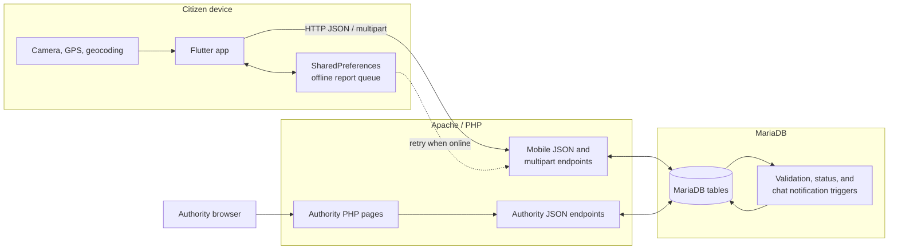

<div align="center">
  

# PatchUp

**A citizen pothole-reporting mobile app and authority management dashboard for Sri Lanka**


[Overview](#overview) &nbsp;•&nbsp; [Features](#features) &nbsp;•&nbsp; [Architecture](#architecture) &nbsp;•&nbsp; [Getting started](#getting-started) &nbsp;•&nbsp; [Testing](#testing) &nbsp;•&nbsp; [Limitations](#known-limitations)

</div>

PatchUp is an academic road-maintenance reporting system with two user-facing applications:

- A **Flutter citizen app** for capturing geotagged pothole reports, browsing community reports, viewing heatmaps, tracking report status, receiving in-app notifications, and talking to administrators about a submitted report.
- A **PHP authority dashboard** for monitoring reports, reviewing charts and heatmaps, changing report status, inspecting customers, managing administrator accounts, and replying to report owners.

Both applications use the same PHP/MySQL-compatible backend and MariaDB schema. The repository is configured as a local XAMPP prototype: API/database settings and the mobile server address are embedded in source, the mobile client communicates over plain HTTP, and the SQL dump contains development seed data. It should not be exposed to the public internet in its current form.

## Features

### Citizen mobile app

- **Account workflow** — registration, password verification, remembered sign-in, logout, profile editing, and password changes.
- **Structured reporting** — camera or gallery image, current GPS coordinates, reverse-geocoded Sri Lankan province, description, and `Small`, `Moderate`, or `Critical` severity.
- **Offline report queue** — stores completed submissions and image paths in `SharedPreferences`, then retries them when Wi-Fi or mobile connectivity returns.
- **Duplicate handling and community validation** — an unresolved report within **12 metres** is treated as the same pothole. A different reporter validates the existing report; the original reporter is prevented from creating a duplicate.
- **Report discovery** — latest reports on the home screen plus community, personal, and personally validated report views.
- **Filtering and heatmaps** — status, severity, province, and date-range filters; severity-weighted density maps centered on Sri Lanka.
- **Status and validation tracking** — report cards display workflow status and validation totals.
- **In-app notifications** — database-generated notifications for validations, report status changes, and new chat messages, with individual and bulk read actions.
- **Report-owner chat** — paginated conversations with three-second polling, optimistic message editing, and soft deletion. Normal users can chat only on reports they own.
- **Localization** — matching English, Sinhala, and Tamil resource sets with a persisted language choice.
- **Profile tools** — personal reports, validated reports, account details, terms, project information, and language selection.

### Authority web dashboard

- **Session-protected administration pages** with login and logout.
- **Operational summary** showing total reports, reports created this month, status and severity distributions, leading reporters, recent activity, and top provinces.
- **Chart and map views** powered by Chart.js, Leaflet, and Leaflet.heat.
- **Report management** with status, severity, and province filters; status transitions among `Reported`, `In Progress`, and `Resolved`; and links to report coordinates.
- **Validation visibility** through per-report counts and a ranked view of validated reports still awaiting action.
- **Administrator chat** with five-second polling and message-count badges.
- **Customer directory** with pagination, per-customer history, filters, validation counts, and a customer-specific heatmap.
- **Administrator management** for listing, adding, editing, and deleting admin records.

> [!NOTE]
> “Real-time” behavior in the current implementation is polling-based. The project does not use WebSockets, Firebase Cloud Messaging, or another push-notification service.

## Architecture



The PHP files under `patchup_app/lib/api/` are server endpoints despite living inside the Flutter project directory. They must be served by Apache; they are not compiled into the mobile application.

### Report lifecycle

1. The app obtains a high-accuracy location and maps the returned district or administrative area to one of Sri Lanka's nine provinces.
2. The user adds a photo, description, and severity level.
3. Online submissions are sent as multipart form data. Offline submissions are stored locally and retried after connectivity returns.
4. The server searches unresolved reports with a Haversine distance calculation:
   - No report within 12 metres → create a new `Reported` item.
   - Same user's report within 12 metres → return the existing report without creating another.
   - Another user's report within 12 metres → add one unique validation for that user and report.
5. Administrators review the report, update its status, and can converse with the owner.
6. MariaDB triggers add in-app notifications when a report is validated, its status changes, or another participant posts a chat message.

### Data model

| Table                | Responsibility                                                                                      |
| :------------------- | :-------------------------------------------------------------------------------------------------- |
| `user`               | Citizen accounts and generated shadow accounts used to satisfy chat foreign keys for administrators |
| `admin`              | Dashboard administrator accounts                                                                    |
| `potholereport`      | Report owner, description, severity, image path, status, province, coordinates, and submission time |
| `pothole_validation` | Unique `(ReportID, UserID)` confirmations                                                           |
| `chat_messages`      | Per-report messages, administrator flag, edit metadata, and soft-delete state                       |
| `notification`       | User-facing validation, status, and chat events with read timestamps and JSON metadata              |

The schema also defines foreign keys, supporting indexes, and three notification triggers. `Xampp Database.sql` is a complete development snapshot, not a migration history.

## Project structure

```text
.
├── patchup_app/
│   ├── assets/
│   │   ├── images/logo/             Branding and launcher artwork
│   │   └── language/                English, Sinhala, and Tamil JSON strings
│   ├── lib/
│   │   ├── api/                     Citizen-facing PHP endpoints
│   │   ├── chat/                    Flutter chat model, service, polling, and UI
│   │   ├── components/              Shared app bar and bottom navigation
│   │   ├── database/                Mobile API database connection
│   │   ├── localization/            JSON localization loader
│   │   ├── pages/                   Authentication, reports, maps, profile, and notifications
│   │   └── main.dart                Flutter entry point and session-aware splash flow
│   ├── uploads/                     Seed report images and runtime upload target
│   ├── android/                     Android runner configuration
│   ├── ios/                         iOS runner configuration
│   ├── test/                        Generated Flutter scaffold test
│   ├── pubspec.yaml                 App metadata and dependency constraints
│   └── pubspec.lock                 Resolved package and SDK requirements
├── patchup_website/
│   ├── api/                         Dashboard data and mutation endpoints
│   ├── css/                         Dashboard-specific styles
│   ├── database/                    Dashboard database connection
│   ├── images/                      Web branding assets
│   ├── javascript/                  Login and responsive navigation behavior
│   └── *.php                        Login, dashboard, reports, customers, and admins
├── Xampp Database.sql               MariaDB schema, triggers, and development seed data
└── README.md
```

Generated Flutter outputs, IDE state, Gradle caches, and downloaded dependencies are intentionally excluded from this overview.

## Technology stack

| Area                        | Technology in this repository                                                                         |
| :-------------------------- | :---------------------------------------------------------------------------------------------------- |
| Mobile UI                   | Flutter, Material widgets, Dart `>=3.7.2 <4.0.0`; the lockfile requires Flutter `>=3.27.0`            |
| Mobile networking and state | `http`, Provider, and `shared_preferences`                                                            |
| Device integration          | `geolocator`, `geocoding`, `image_picker`, and `connectivity_plus`                                    |
| Mobile mapping              | `flutter_map` 6.1.x, `flutter_map_heatmap`, `latlong2`, and CARTO raster tiles                        |
| Server                      | PHP 8.2-style code using MySQLi and PHP sessions                                                      |
| Database                    | MariaDB 10.4.32 / MySQL-compatible SQL, as recorded by the database dump                              |
| Dashboard                   | Server-rendered PHP, JavaScript, CSS, Tailwind CSS via CDN, Chart.js, Feather Icons, and Font Awesome |
| Web mapping                 | Leaflet, Leaflet.heat, and OpenStreetMap tiles                                                        |
| Local runtime               | XAMPP (Apache, PHP, and MariaDB)                                                                      |

## Getting started

### Prerequisites

- Flutter SDK compatible with Flutter `>=3.27.0` and Dart `>=3.7.2 <4.0.0`
- XAMPP, or an equivalent Apache + PHP 8.2 + MariaDB/MySQL environment
- An Android device or emulator for the currently verified local-development path
- A development computer and physical device on the same local network when using a LAN host
- Internet access for package resolution, map tiles, and dashboard CDN assets

Run the commands below from the repository root unless a step says otherwise.

### 1. Expose the PHP applications

The hard-coded URL paths expect both application folders to be direct children of the Apache document root:

```text
C:\xampp\htdocs\
├── patchup_app\
└── patchup_website\
```

Copy the two folders there, configure equivalent Apache aliases, or use a virtual host whose document root contains them. Ensure Apache can write to `patchup_app/uploads/` for image uploads.

### 2. Create and import the database

Start Apache and MySQL from the XAMPP control panel. In phpMyAdmin:

1. Create a database named `patchup` using an `utf8mb4` collation.
2. Select the database and import `Xampp Database.sql`.

The same operation can be performed from PowerShell with the XAMPP client:

```powershell
& 'C:\xampp\mysql\bin\mysql.exe' -u root -e "CREATE DATABASE IF NOT EXISTS patchup CHARACTER SET utf8mb4 COLLATE utf8mb4_general_ci"
Get-Content -Raw '.\Xampp Database.sql' | & 'C:\xampp\mysql\bin\mysql.exe' -u root patchup
```

Add `-p` to each client invocation if the local database user requires a password. The import creates six tables, their keys and indexes, three triggers, and development seed records.

### 3. Configure the database connection

The repository has no `.env` layer. Review the connection variables in both files and set them for your local database without committing credentials:

- `patchup_app/lib/database/db_connection.php`
- `patchup_website/database/db_connection.php`

The required variable names are `$host`, `$user`, `$password`, and `$dbname`; the database name must match the imported `patchup` database.

### 4. Configure the mobile API host

The mobile API origin is repeated in source rather than centralized. Find every occurrence:

```powershell
rg -n "http://[0-9.]+/patchup_app" patchup_app/lib -g "*.dart"
```

Replace the existing origin with the development server reachable from the device, for example:

```text
http://<development-machine-lan-ip>/patchup_app
```

Do not use `localhost` from a physical phone: it refers to the phone itself. The device and XAMPP host must be on the same network, and the host firewall must permit the required local Apache traffic.

### 5. Install and run the mobile app

```powershell
cd patchup_app
flutter pub get
flutter run
```

Grant location and camera/gallery permissions when prompted. The app registers or signs in a citizen, stores the email in local preferences, and opens the four-tab Home / Report / Reports / Profile interface.

### 6. Open the authority dashboard

With Apache and MariaDB running, browse to:

```text
http://localhost/patchup_website/login.php
```

The SQL snapshot includes development administrator records. Replace the seed data before any shared deployment and do not reuse its credentials outside an isolated local environment.

## Configuration reference

| Setting                          | Current implementation                          | Where to change it                                 |
| :------------------------------- | :---------------------------------------------- | :------------------------------------------------- |
| Mobile API origin                | Repeated plain-HTTP LAN URL                     | Dart files reported by the `rg` command above      |
| Database host/user/password/name | PHP variables in source                         | Both `database/db_connection.php` files            |
| Duplicate radius                 | `12.0` metres                                   | `patchup_app/lib/api/pothole_report.php`           |
| Mobile chat polling              | Every 3 seconds                                 | `patchup_app/lib/chat/chat_service.dart`           |
| Dashboard chat polling           | Every 5 seconds                                 | `patchup_website/manage_reports.php`               |
| Report statuses                  | `Reported`, `In Progress`, `Resolved` in the UI | Mobile and dashboard report screens                |
| Mobile locale                    | `en`, `si`, or `ta`, persisted locally          | `patchup_app/lib/main.dart` and `assets/language/` |

No environment-variable template is included. Treat the source-level configuration as development-only and avoid adding real secrets to version control.

## Using PatchUp

| Citizen workflow                                  | Authority workflow                                              |
| :------------------------------------------------ | :-------------------------------------------------------------- |
| Register or sign in                               | Sign in to the dashboard                                        |
| Capture or select an image                        | Review totals, charts, recent activity, and province statistics |
| Fetch GPS coordinates and province                | Filter reports and inspect the heatmap                          |
| Add description and severity                      | Review validations and reporter history                         |
| Submit immediately or queue offline               | Change the report status                                        |
| Browse community, personal, and validated reports | Reply to the report owner in the report chat                    |
| Read status/validation/chat notifications         | Manage customer and administrator records                       |

Submitting a nearby report is the validation action; there is no separate upvote button in the current mobile UI.

## API surface

The endpoints are procedural PHP scripts rather than a versioned REST service.

| Group                      | Endpoints                                                                                                                                        | Purpose                                                                                   |
| :------------------------- | :----------------------------------------------------------------------------------------------------------------------------------------------- | :---------------------------------------------------------------------------------------- |
| Authentication and profile | `register.php`, `login.php`, `get_user_info.php`, `update_user_info.php`, `change_password.php`                                                  | Citizen account creation, verification, lookup, and updates                               |
| Reports and maps           | `pothole_report.php`, `display_reports.php`, `display_reports_home.php`, `display_validated_reports.php`, `heatmap_points.php`, `home_stats.php` | Multipart submission, duplicate detection, report feeds, heatmap points, and home metrics |
| Notifications              | `get_notifications.php`, `mark_notifications_read.php`                                                                                           | Fetch and acknowledge in-app notifications                                                |
| Mobile chat                | `get_chat_messages.php`, `add_chat_message.php`, `update_chat_message.php`, `delete_chat_message.php`                                            | Pagination, polling, send, edit, and soft delete                                          |
| Dashboard                  | `home_status.php`, `manage_reports.php`, `view_customers.php`, `report_confirmations_counts.php`, `manage_admins.php`, `chat_messages.php`       | Admin analytics and management operations                                                 |

The dashboard mutation endpoints use PHP sessions. Most mobile endpoints identify a user by the submitted email address and do not validate a server-issued access token; see [Security and privacy](#security-and-privacy).

## Testing

### Available checks

From `patchup_app/`:

```powershell
flutter analyze
flutter test
```

For PHP syntax from the repository root:

```powershell
Get-ChildItem patchup_app/lib, patchup_website -Recurse -Filter *.php |
  ForEach-Object { & 'C:\xampp\php\php.exe' -l $_.FullName }
```

> [!WARNING]
> The repository does not currently contain a meaningful automated application test suite. `test/widget_test.dart` is Flutter's generated counter test and no longer matches `MyApp`; `ios/RunnerTests/RunnerTests.swift` is an empty scaffold. There is no CI workflow or coverage configuration, so no passing-test or coverage badge is shown.

Manual integration testing requires Apache, MariaDB, imported seed data, a reachable mobile API host, device permissions, and external map/CDN access.

## Security and privacy

This repository is an educational prototype and needs security work before deployment:

- Mobile requests use plain HTTP and a hard-coded private-network origin.
- Mobile login does not establish a server session or token. Several API operations authorize by email address alone.
- Dashboard administrator passwords are stored and compared as plain text in the current schema/API, although citizen passwords use PHP password hashing.
- Database credentials live in PHP source because no environment configuration layer is implemented.
- Uploaded files are written into a web-accessible folder without robust MIME type, extension, or size validation.
- The SQL snapshot and `uploads/` directory contain development records and sample user-generated content; review or remove them before sharing a deployment.
- Local preferences store the signed-in email, cached profile details, and queued report payloads without application-level encryption.

Do not expose the current Apache endpoints publicly, use real credentials in the seed database, or treat the implementation as production-ready.

## Known limitations

- Only **report submissions** are queued offline. Authentication, report feeds, heatmaps, chat, notifications, and dashboard features require the server.
- Map tiles are not available offline; `flutter_map_tile_caching` is declared but not used by the application.
- Notifications are database-backed and fetched by the app. The profile notification switch is not persisted or connected to notification delivery.
- “Forgot Password?” is present in the login UI but has no action.
- API origins, database settings, polling intervals, and workflow values are not centrally configurable.
- The Android main manifest lacks the internet permission used by release builds, while debug/profile manifests include it; the current plain-HTTP transport also needs an explicit release policy.
- The iOS `Info.plist` is malformed by an extra closing tag, does not declare camera/photo-library usage descriptions, and does not permit the current plain-HTTP development transport.
- The launcher-icon configuration references `assets/images/logo/Logo.webp`, which is not present; the tracked logo files have numbered names.
- The dashboard loads major UI libraries from public CDNs and will be incomplete without internet access.
- The repository includes no migrations, automated API tests, end-to-end tests, deployment configuration, or CI/CD workflow.

## Contributors

PatchUp was developed as a Level 5 Commercial Computing group project by:

- Dillon Fernandez
- Hiranya Nirmal
- Sanura Devjan
- Akshith Rithushan

---

<div align="center">
  <p><strong>Disclaimer</strong></p>
  <p><em>This is an academic project developed for educational purposes and is not intended for commercial use.</em></p>
</div>
